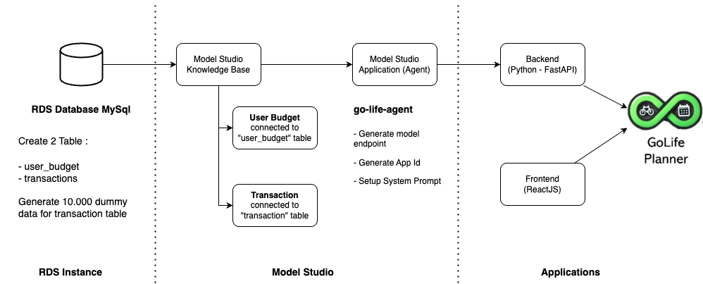
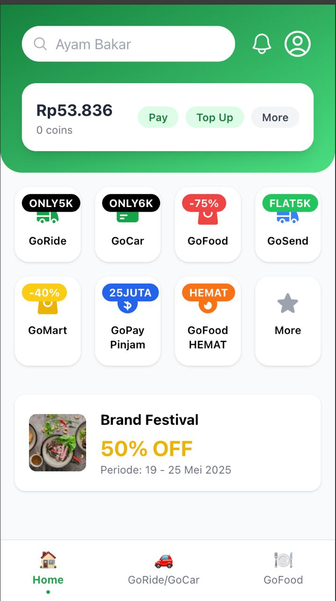
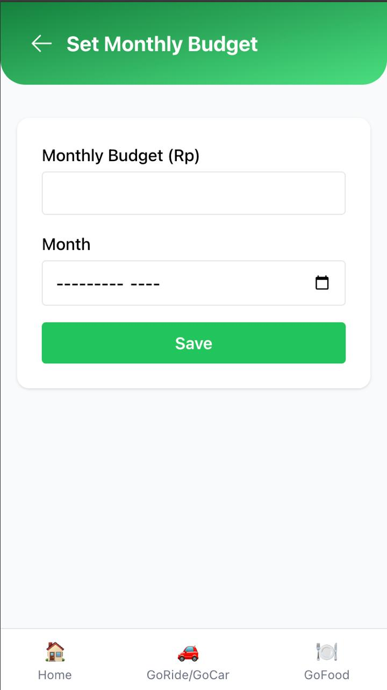
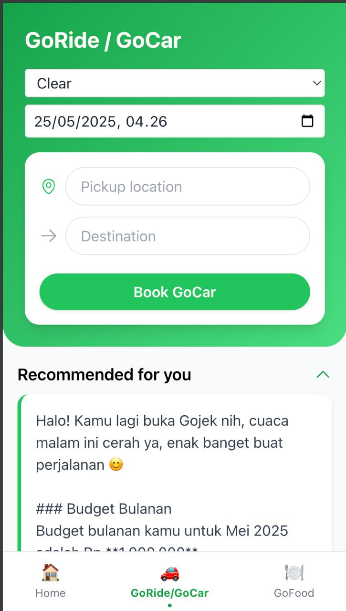

# Go-Planner


---

## System Flow



---

Go-Planner is a full-stack application inspired by super-apps like Gojek, providing personalized recommendations and budget management for users. The project is divided into two main parts:

- **Backend**: Built with FastAPI (Python), serving as the API and business logic layer.
- **Frontend**: Built with React and Tailwind CSS, providing a modern and responsive user interface.

---

## Project Structure

```
Go-Planner/
│
├── backend/   # FastAPI backend service (Python)
│   └── ...
│
├── frontend/  # React frontend application (JavaScript)
│   └── ...
│
└── README.md  # High-level project overview (this file)
```

---

## Backend
- Located in the `backend/` folder.
- Provides RESTful API endpoints for recommendations and budget management.
- Built with FastAPI, supports async processing, and connects to a database (MySQL or PostgreSQL).
- See [`backend/README.md`](./backend/README.md) for setup and usage instructions.

## Frontend
- Located in the `frontend/` folder.
- Built with React and styled using Tailwind CSS.
- Communicates with the backend API for real-time recommendations and budget updates.
- See [`frontend/README.md`](./frontend/README.md) for setup and usage instructions.

---

## Getting Started
1. **Set up the backend**: Follow the instructions in `backend/README.md` to install dependencies and run the API server.
2. **Set up the frontend**: Follow the instructions in `frontend/README.md` to install dependencies and run the React app.
3. Make sure both servers are running for full functionality.

---

## Setting Up the Model in Alibaba Model Studio

This project can be integrated with a machine learning model hosted on Alibaba Model Studio for advanced recommendations. In this setup, you create an **app (agent)** in Model Studio and integrate it with a **knowledge (data source) MySQL database** from Alibaba Cloud RDS. This allows the agent to access and utilize your data for more accurate and context-aware recommendations.

To set up and use a model from Alibaba Model Studio:

1. **Create or Train Your Model / Agent**  
   - Log in to [Alibaba Cloud Model Studio](https://modelstudio.console.aliyun.com/).
   - Create a new app (agent) or use an existing one.
   - Integrate the agent with your knowledge base by connecting it to a MySQL database hosted on Alibaba Cloud RDS.
   - Train or configure your recommendation model as required.

2. **Deploy the Model as an Online Service**  
   - After training or configuring, deploy the agent/model as an online endpoint (API service).
   - Note the endpoint URL and any required authentication keys or tokens.

3. **Configure the Backend to Use the Model**  
   - In the `backend/.env` file, add the following environment variables:
     ```
     MODEL_API_URL=<your-alibaba-model-endpoint>
     MODEL_API_KEY=<your-api-key-if-needed>
     ```
   - Update the backend service code (typically in `app/services/recommender.py` or similar) to send requests to the Alibaba Model Studio endpoint using these variables.

4. **Test the Integration**  
   - Restart the backend server.
   - Trigger a recommendation request from the frontend or via API to ensure the backend is correctly communicating with the Alibaba Model Studio agent and utilizing the knowledge from your MySQL RDS database.

> **Note:**  
> Make sure your Alibaba Model Studio endpoint is accessible from your backend server and that you handle any authentication required by Alibaba Cloud.

---

## About This Project
This project is for educational and demonstration purposes, showcasing a simple architecture for a modern web application with clear separation between backend and frontend.

Feel free to explore each folder for more detailed documentation and code. 

---

## Demo Video


---

## Screenshoot

**Home Page**  


**Budgeting Page**  


**Goride/Gocar Page**  


**Gofood Page**  
